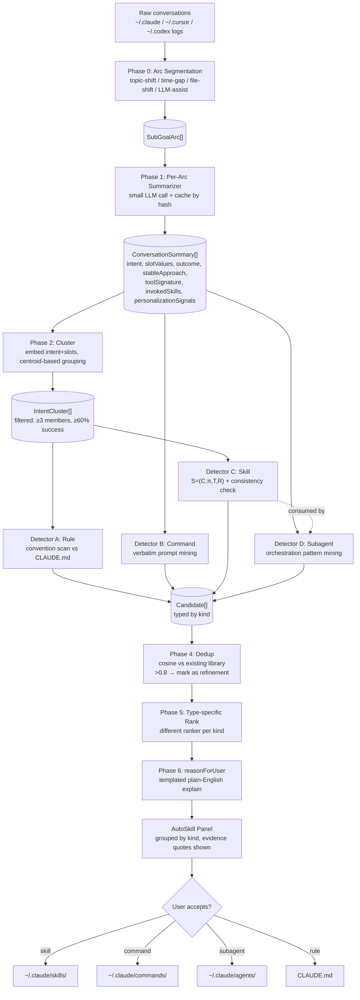

# Signal-Detection Pipeline — Design Proposal

**Status:** Proposed (LOC-69). Implementation tracked across LOC-70..LOC-79.
**Author:** Captured from design discussion 2026-05-23.
**Replaces:** the current free-form `server/src/autoSkill/digest.ts` candidate generator.

---

## What this proposal is about

The existing AutoSkill digest reads weeks of Claude/Cursor/Codex conversation history and asks Ollama to "find skills." It's effectively one big LLM call per chunk that has to simultaneously decide *what's worth extracting*, *how to describe it*, and *what type of artifact to propose*. The result is inconsistent — sometimes great, sometimes nonsense — and there's no way to explain to the user *why* a candidate appeared.

This proposal replaces that with a multi-phase pipeline that:

1. **Separates detection from synthesis** — first decide *what's worth proposing*, then worry about writing it
2. **Operates on sub-goal arcs**, not whole conversations or arbitrary chunks — so jumpy multi-topic sessions don't get averaged into garbage signal
3. **Runs four parallel detectors**, one per artifact type (skill / command / subagent / CLAUDE.md rule) with different bars and different ranking
4. **Explains every candidate** with a `reasonForUser` plain-English string the user can verify

The pipeline is designed to be grounded in published research, not just intuition. See [§ Research backing](#research-backing).

---

## The big picture

---

## Why each phase exists

### Phase 0 — Arc segmentation

**Problem it solves:** A 4-hour Claude Code session might contain "fix bug → write tests → answer unrelated question → resume bug." If we summarize that as one unit, the intent field becomes useless ("a mix of bug fixing, testing, and unrelated questions"). All downstream clustering then conflates distinct workflows.

**Approach:** Split each conversation into sub-goal arcs using cheap heuristics first (topic-shift phrases like "switching gears", time gaps > 30 min, file-type shifts, resolution-then-new-ask patterns). Only invoke a small LLM call when heuristics produce ambiguous results on long conversations.

**Why this matters:** The arc — not the conversation, not the chunk — is the natural unit of analysis for skill discovery. One conversation can contribute multiple arcs to clustering; multiple conversations can contribute arcs to the same cluster.

### Phase 1 — Per-arc summarization

**Problem it solves:** Raw transcripts are too noisy to cluster directly. We need structured features.

**Approach:** Small-model LLM call (`qwen2.5:3b`) per arc emits a `ConversationSummary` with explicit fields: `intent`, `slotValues`, `resolutionSteps`, `outcome`, `stableApproach`, `subGoals`, `toolSignature`, `invokedSkills`, `verbatimUserPrompts`, `correctionMarkers`, `personalizationSignals`. Cache by content hash so repeat digests only summarize new arcs.

**Why this matters — backed by research:** Choubey et al. ([arXiv 2502.17321](https://arxiv.org/html/2502.17321v1)) showed empirically that *"relying on conversations is less effective than explicit procedural elements"* — clustering on extracted features beats clustering on raw text. This phase produces those features.

**Filter:** drop arcs where `outcome == 'failed'` AND `stableApproach == false`. No skill signal in failed exploratory chains.

### Phase 2 — Centroid clustering

**Problem it solves:** Need to group similar arcs across conversations to detect recurrence.

**Approach:** Embed `intent + slotValues` per arc using local Ollama embeddings (`nomic-embed-text`), then k-means clusters. For each cluster, pick the **centroid** member (closest to mean) as the representative. Aggregate stats: recurrence count, date span, median gap, common tool signature, convergent approach (intersection of resolution steps), outcome breakdown.

**Filters:** drop clusters with `<3` members (rule of three from Fowler/Roberts), or `<60%` success rate.

**Why centroid not diversity — backed by research:** Choubey et al. also tested diversity-based sampling and found it *worse* than centroid-based — *"prioritizing diversity introduces noise from real-world conversations."* The densest part of a cluster is where signal lives; the edges are noise.

**Why a success-rate filter:** SkillsBench ([arXiv 2602.12670](https://arxiv.org/abs/2602.12670)) measured this directly — self-generated skills with low success-rate provenance *degraded* model performance. Only promote clusters that actually worked.

### Phase 3 — Four parallel detectors

This is the most novel piece of the design. Earlier proposals had a single "signal detector" that emitted one candidate type. That was wrong — different artifact types have fundamentally different bars, signals, and downstream costs.

#### The four-artifact taxonomy

| Artifact | Bar | Detection signal | What it captures | Why this bar |
|---|---|---|---|---|
| **CLAUDE.md rule** | high | recurring always-on convention with no specific trigger ("always X", "never Y") | conventions, style, defaults | always loaded — every conversation pays the token tax |
| **Command** | **low — just text** | same/similar prompt text typed 2-3+ times across sessions | repeatable prompt text user explicitly invokes | near-zero cost (one slash listing entry), no auto-trigger risk |
| **Skill** | medium-high — needs outcome + stability | repeated procedure with successful outcome and stable approach across 3+ sessions | procedural workflow auto-triggered by description match | description-match loads body, mis-trigger risk |
| **Subagent** | high — composition signal | repeated orchestration pattern, often invoking multiple skills, with bounded input/output | multi-step orchestration with own context | dedicated context window, expensive to spawn |

Commands absorb the false-positives that aren't quite stable enough to be skills. Skills absorb only the stable, recurring procedures. Subagents absorb compositions of skills. Rules absorb the things that should never have been a skill in the first place (always-on conventions).

#### Detector dependencies

The skill detector and subagent detector aren't independent — subagents are *compositions* of skills, so the subagent detector consumes:
- The arc summaries (to see what orchestration patterns recur)
- The skill candidates *just produced by the skill detector* (so newly-proposed skills can show up as subagent constituents alongside existing skills)

This creates a virtuous feedback loop: the more skills the user accepts, the better the subagent detector gets over time.

#### Programmatic consistency check (skill detector only)

The skill detector includes a verification step adapted from NSI ([arXiv 2605.01293](https://arxiv.org/html/2605.01293)): hold out 2 cluster members, ask the LLM "would this candidate skill, if applied to this held-out conversation, produce a similar outcome?" Require ≥1/2 yes-votes to keep the candidate. Filters out clusters where the surface pattern matches but the underlying intent diverges.

### Phase 4 — Dedup against existing library

**Problem it solves:** If the user already has a skill that's 80% the same as what we'd propose, we shouldn't propose a sibling — we should flag it as a refinement opportunity.

**Approach:** Embed each candidate's `name + description`, compare against existing skills/commands/subagents/CLAUDE.md content. Cosine similarity > 0.8 → mark `isRefinementOf = <existing-name>`. The candidate isn't dropped — the user sees it with a "Refines existing X" badge plus a diff.

### Phase 5 — Type-specific ranking

Each artifact type has a different ranking formula because the value model is different:

- **Skill rank:** `recurrence × recency_decay × success_rate × personalization_weight`
  - Personalization weight boosts skills that capture user style — SkillsBench's finding that software engineering is the *low-gain* domain for generic skills (+4.5pp vs +51.9pp healthcare) means the real value here is personalization, not generic procedures
- **Command rank:** `invocations × recency_decay × log(prompt_length)` — longer prompts have more value to template
- **Subagent rank:** `recurrence × composition_complexity × existing_skill_coverage` — favor subagents that orchestrate skills the user already owns
- **Rule rank:** `breadth × specificity_score` — rules need to be specific enough to matter, broad enough to recur

Truncate to top-K=10 per type (per "less data beats more" finding — surface fewer, better candidates rather than overwhelming with noise).

### Phase 6 — reasonForUser

**Problem it solves:** The current digest's candidates are accept-or-reject mysteries. The user has no idea *why* a particular skill was suggested.

**Approach:** Templated plain-English string per candidate, interpolating cluster stats and evidence count. Examples:

- Skill: *"This pattern appeared in 7 conversations over the last 18 days. Most recent: 2026-05-21. 6 of 7 ended successfully with the same approach."*
- Command: *"You typed this prompt 4 times across 3 conversations. Most recent: 2026-05-22."*
- Subagent: *"You ran skills [pr-review, run-tests, write-changelog] in this sequence across 5 conversations to accomplish similar bounded outcomes."*
- Rule: *"This directive appeared in 8 conversations across different task types — looks like an always-on convention rather than a per-task instruction."*

Mostly no LLM cost in this phase — pure templating with cluster stats already computed in Phase 2.

---

## What this pipeline deliberately does NOT do

These are anti-patterns we explicitly reject, mostly because research warned us against them:

- **Iterative refinement of candidates.** Choubey et al. found reflection prompting *degrades* output. One pass; if validation fails, drop the candidate.
- **Diversity sampling.** Same paper: diversity introduces noise. Centroid wins.
- **Sweep everything.** Filtering wins. The pipeline aggressively filters at every phase rather than trying to surface every possible candidate.
- **Auto-accept anything.** SkillsBench warned self-generated skills can hurt performance if domain-specificity and verifiability aren't preserved. Humans stay in the loop on accept/reject.
- **Body synthesis in this pipeline.** Generating the actual skill body markdown is a separate concern. For v1 we'll do a simple section-concatenation (the S-tuple fields with H2 headers). Proper template generation is future work — likely revisits the canceled LOC-67 with QA-CoT (Guide/Implementer dialogue from Choubey et al., +12-16% over flat prompting).

---

## Research backing

All citations verified — primary sources read, not just survey citations. See LOC-66 comments for the full audit including 3 papers I had originally cited that were unverified and were removed.

| Paper | What it gave us |
|---|---|
| [SkillsBench (arXiv 2602.12670)](https://arxiv.org/abs/2602.12670) — empirical, 86 tasks × 11 domains × 7 model configs × 7,308 trajectories | Strict bar for skills (self-generated can hurt). Software engineering = low-gain domain (+4.5pp) → bias toward personalization signals. Focused 2-3 modules > comprehensive docs. |
| [SoK: Agentic Skills (arXiv 2602.20867)](https://arxiv.org/html/2602.20867v1) — survey | Formal skill structure S = (C, π, T, R). Formal distinction of skills vs tools vs plans vs memory vs prompt templates → backs the four-artifact taxonomy. |
| [Turning Conversations into Workflows (arXiv 2502.17321)](https://arxiv.org/html/2502.17321v1) — empirical, ABCD + SynthABCD benchmarks | Extract procedural elements before clustering. Centroid > diversity. Less data > more. No refinement loops. QA-CoT for future synth work. |
| [Lifting Traces to Logic / NSI (arXiv 2605.01293)](https://arxiv.org/html/2605.01293) — method | Programmatic consistency check as skill validator. Sub-goal segmentation of trajectories → Phase 0. |

---

## Cost model

Per digest run, for a corpus of N conversations producing ~K arcs and ~C clusters:

| Phase | LLM calls (cold cache) | LLM calls (warm cache) |
|---|---|---|
| 0 Arc segmentation | 0 to K (only when heuristics fail) | 0 |
| 1 Per-arc summarize | K (small model) | 0 (cache hit) |
| 2 Cluster (embeddings) | K embedding calls | 0 |
| 3a Rule detector | 1 (batch convention classifier) | 1 |
| 3b Command detector | 0 | 0 |
| 3c Skill detector | ~2C (synth + consistency, only for surviving clusters) | ~2C |
| 3d Subagent detector | ~1 per surviving pattern | ~1 per pattern |
| 4-6 Dedup, rank, explain | embeddings + 0 LLM | embeddings + 0 LLM |

For a typical corpus (~200 conversations → ~400 arcs → ~20 surviving clusters), cold-run ≈ 440 small-model LLM calls. Warm-run ≈ 40. Most calls are parallelizable.

---

## Implementation roadmap

Tracked in Linear, all under LOC-69:

| # | Ticket | What |
|---|---|---|
| 1 | LOC-70 | Foundation — feature branch + types + scaffolding |
| 2 | LOC-71 | Phase 0 — arc segmentation |
| 3 | LOC-72 | Phase 1 — per-arc summarizer + caching |
| 4 | LOC-73 | Phase 2 — centroid clustering |
| 5 | LOC-74 | Detectors A+B — rule + command |
| 6 | LOC-75 | Detector C — skill + consistency check |
| 7 | LOC-76 | Detector D — subagent (orchestration mining) |
| 8 | LOC-77 | Dedup + ranking + reasonForUser |
| 9 | LOC-78 | UI + accept flows (esp. CLAUDE.md rule) |
| 10 | LOC-79 | E2E integration + tuning + merge to main |

Work lives on `feature/signal-detection-pipeline`, merges to `main` only at step 10. The existing free-form digest stays in production until the new pipeline is tuned and validated on real data.

---

## Open questions to resolve during implementation

1. **Embedding model availability.** Default is `nomic-embed-text` via Ollama. Need a fallback story if it's not pulled (parallels LOC-64's onboarding work).
2. **Clustering algorithm.** Starting with k-means + elbow. May need HDBSCAN if clusters are uneven sizes in practice.
3. **LLM cost per digest.** ~440 cold calls is acceptable for an on-demand digest but probably not for a background-tick. Tune in LOC-79.
4. **Personalization weight calibration.** The 0.5 boost per 5 personalization signals is a guess. Tune on real data in LOC-79.
5. **Subagent feedback loop seeding.** Until the user has accepted some skills, the subagent detector has nothing to compose. Probably fine — accept that v1 produces few or no subagent candidates for fresh users.
